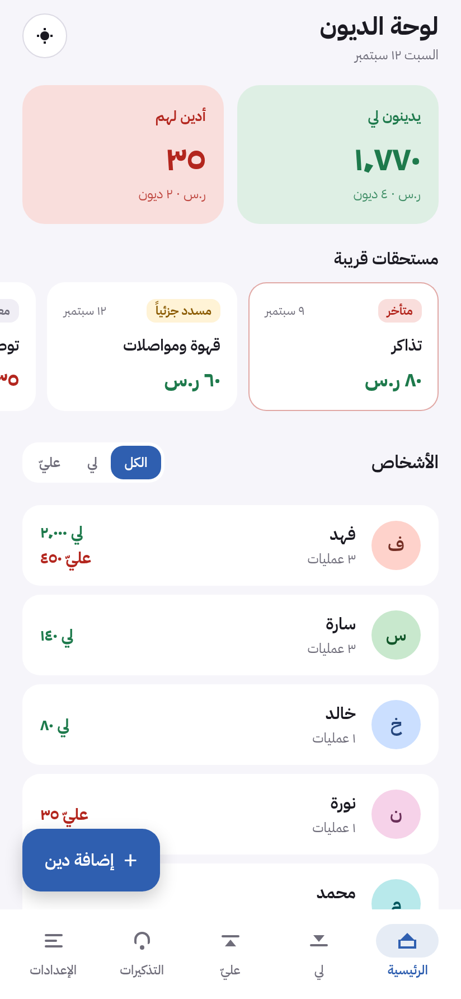
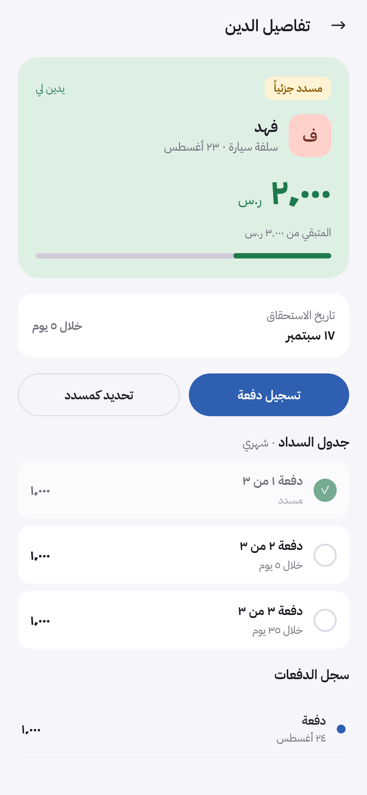
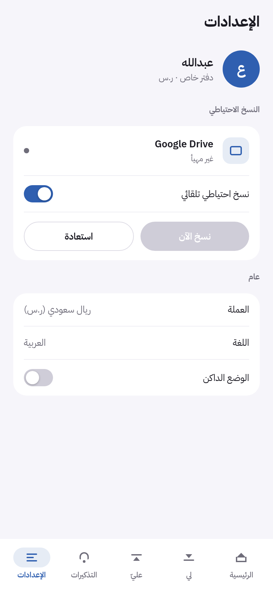

# دفتر الديون — IoU / UoM

A private, Arabic-first (RTL) debt ledger for Android, in Saudi Riyal. Track who
owes you and who you owe, split debts into monthly instalments, settle in full
or in part, get local reminders, and back the whole book up wherever you like.

Built with React Native + Expo SDK 57 from a [Claude Design](https://claude.ai/design)
prototype, which is kept in [`design/`](design/) for reference.

| Home | Debt detail | Backup setup |
|---|---|---|
|  |  |  |

## Features

- **Two-sided ledger** — running balance per person, full transaction history
- **Instalment plans** — split a debt into N monthly payments, tick them off individually
- **Settlement** — pay a specific debt or let a payment flow across a person's debts oldest-first
- **Reminders** — local notifications on due dates, per-debt opt-out, plus a weekly nudge. Nothing is ever sent to the other party.
- **Light and dark themes**, following the system by default
- **Offline first** — the ledger lives on the device; no server, no account required

## Backup

Choose a destination in Settings → النسخ الاحتياطي. All three write the same
`iou-backup.json`, so you can switch between them freely.

| Destination | Setup needed | Automatic |
|---|---|---|
| **مجلد على الجهاز** — pick any folder once | none | yes |
| **ملف** — export via the share sheet, import via the file picker | none | no |
| **Google Drive** — app-private folder in your account | developer must add OAuth client IDs | yes |

The folder option is the recommended one: Android grants the app a *persistable*
permission to that folder, so the choice survives restarts, and the folder can be
one that Google Drive, Nextcloud or Syncthing already syncs.

Google Drive is optional and ships **unconfigured** — no credentials are in this
repository. See [`app/README.md`](app/README.md) for how to add your own.

## Getting the APK

Every push to `main` builds an APK in CI. Open the latest run under
[**Actions → Build Android APK**](../../actions/workflows/android.yml) and
download the `iou-apk` artifact, or from a clone:

```bash
gh run download --name iou-apk -D .
adb install iou-debug-signed.apk
```

It is a universal APK (~69 MB) carrying all four ABIs, so it installs on any
Android device without picking a variant.

> The CI APK is signed with the React Native template's **debug** keystore. It
> installs on any device, but it is not suitable for the Play Store. To publish,
> add your own keystore and wire it into `signingConfigs.release`.

## Building locally

```bash
cd app
npm install
npm start            # Expo dev server — press "a" for Android
npm run android      # build and launch on a connected device
npm run typecheck
npm run check        # pure-logic assertions
```

Google sign-in and notifications need a development build (`npx expo run:android`),
not Expo Go.

## Repository layout

```
app/        the React Native application
design/     the original Claude Design handoff bundle (HTML prototype)
.github/    CI that builds the APK
```

Implementation notes, architecture, and the list of deliberate deviations from
the prototype are in [`app/README.md`](app/README.md).
