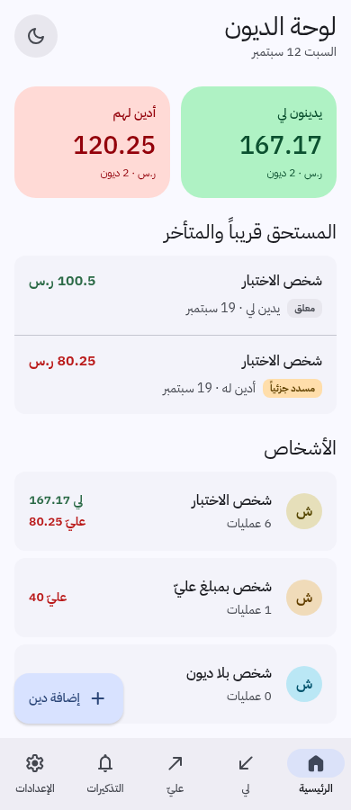
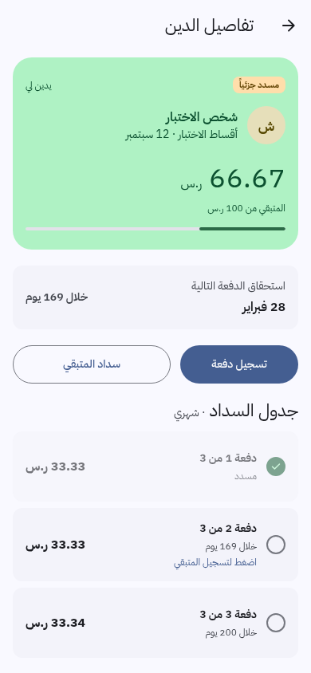
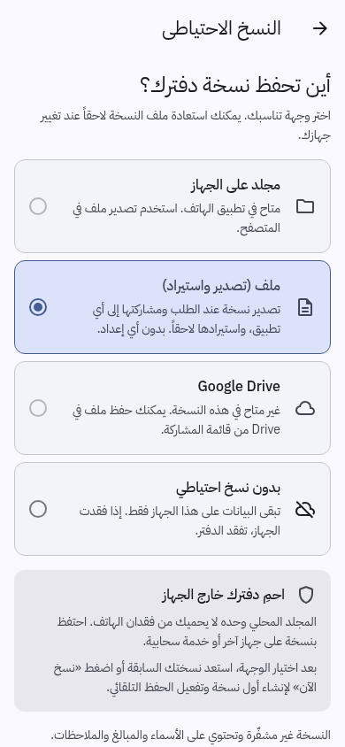

# دفتر الديون — IoU / UoM

A private, Arabic-first (RTL) debt ledger for Android, in Saudi Riyal. Track who
owes you and who you owe, split debts into monthly instalments, settle in full
or in part, get local reminders, and back the whole book up wherever you like.

Built with React Native + Expo SDK 57 from a [Claude Design](https://claude.ai/design)
prototype, which is kept in [`design/`](design/) for reference. The app now follows
[Material 3](https://m3.material.io/) with Arabic typography and adaptive RTL navigation.

| Home | Debt detail | Backup setup |
|---|---|---|
|  |  |  |

## Features

- **Two-sided ledger** — separate amounts receivable/payable, a net balance per person, and full transaction history
- **Instalment plans** — split a debt into N monthly payments, tick them off individually
- **Settlement** — record money received or paid against a specific debt, or across that direction's debts oldest-first
- **Corrections** — edit debts and payments, undo the latest edit, cancel mistaken entries, and restore cancellations with a visible history.
- **Actual dates** — record when money changed hands, separately from when you entered it.
- **Reminders** — choose the time, advance notice, overdue repetition, weekly day, and snoozes. Nothing is sent to the other party.
- **Optional privacy lock** — biometrics where available, with a simple PIN fallback and private notification previews.
- **Light and dark themes**, following the system by default
- **Offline first** — the ledger lives on the device; no server, no account required

## Backup

Choose a destination in Settings → النسخ الاحتياطي. Folder backups and manual
exports use the same portable ledger data and can be restored across devices.

| Destination | Setup needed | Automatic |
|---|---|---|
| **مجلد على الجهاز** — pick any folder once | none | yes |
| **ملف** — export via the share sheet, import via the file picker | none | no |
| **Google Drive** — optional app-private cloud integration | disabled pending native authorization integration and verification | planned |

After choosing a destination, restore an existing backup or use **نسخ الآن** to
save the first copy. Automatic folder backups run after edits while the app is
open. Opening the app or selecting a folder never immediately overwrites an
existing backup. Folder backups retain the latest 10 verified dated snapshots;
the device also keeps 10 local recovery points before ledger changes.

A folder on the same phone does **not** protect against losing the phone. Keep an
additional copy off the device; syncing a folder depends on your chosen provider.
The default export is an offline HTML report with balances, transactions,
installments, correction history, and CSV downloads for spreadsheets. It can be
read without IoU and imported back into the app. An optional password-protected
report provides encryption; ordinary reports, CSVs and folder backups are readable.
Mobile export opens the share sheet; browser export downloads the file. See
[backup formats and recovery](app/docs/BACKUPS.md).

Google Drive ships **disabled**. OAuth client IDs alone are insufficient for the
current native sign-in flow; see [`app/README.md`](app/README.md).

## Getting the APK

Download **iou-0.1.0-alpha.1.apk** from the [0.1 Alpha 1 release](https://github.com/witcherxz/iou/releases/tag/v0.1.0-alpha.1), or use the GitHub CLI:

```bash
gh release download v0.1.0-alpha.1 --pattern 'iou-*.apk' --pattern '*.apk.sha256' -D .
sha256sum -c iou-0.1.0-alpha.1.apk.sha256
adb install iou-0.1.0-alpha.1.apk
```

GitHub Actions builds a production release APK with a dedicated signing key and debugging disabled. The universal APK supports Android's four ABIs. Main-branch builds are available as Actions artifacts; version tags publish prereleases with an APK and checksum.

Fresh installs start with an empty **دفتري** ledger. Demo fixtures and prototype names are excluded from the app's dependency graph. The production package `io.github.witcherxz.iou` installs alongside the old debug package `com.example.iou`; export any real records from the old app and import them into the alpha before removing it. Existing records are never silently cleared.

See [release notes](app/docs/releases/0.1.0-alpha.1.md) and [release maintenance](app/docs/RELEASING.md) for signing, versions, checks and alpha limitations.

## Building locally

```bash
# Node.js 22.13+ (Expo SDK 57)
cd app
npm install
npm start            # Expo dev server — press "a" for Android
npm run android      # build and launch on a connected device
npm run typecheck
npm run check        # ledger, recovery, encryption, privacy, reminders and contrast
```

Google sign-in and notifications need a development build (`npx expo run:android`),
not Expo Go.

## Repository layout

```
app/        the React Native application
design/     the original Claude Design handoff bundle (HTML prototype)
.github/    CI that builds the APK
```

Implementation notes, architecture, and the list of deliberate deviations from
the prototype are in [`app/README.md`](app/README.md).

The app starts with an empty ledger. Prototype data is available only to automated
tests and is excluded from the runtime dependency graph. Review findings and remaining release checks are
in [`app/docs/REVIEW.md`](app/docs/REVIEW.md).

Material 3 design decisions, verification, and current screenshots are in
[`app/docs/MATERIAL3.md`](app/docs/MATERIAL3.md).

The latest corrections, privacy, reminder and recovery work is documented in
[`app/docs/FEATURES.md`](app/docs/FEATURES.md).
