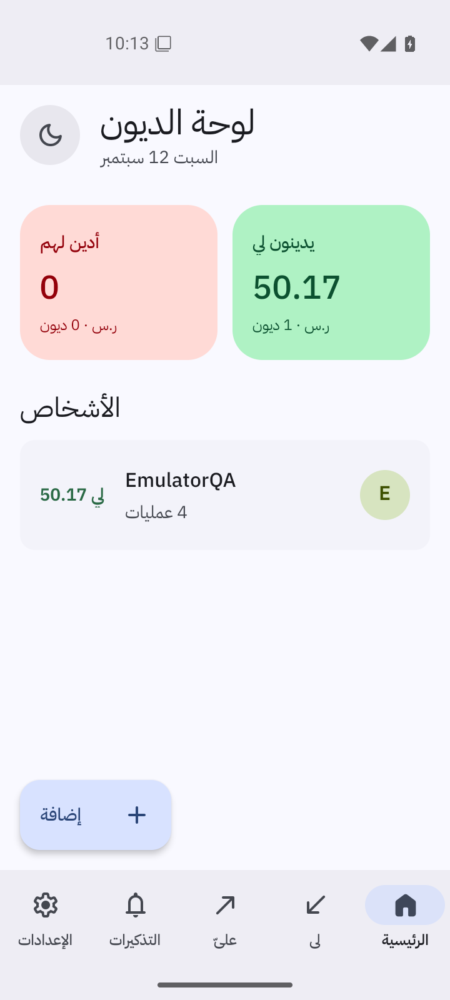
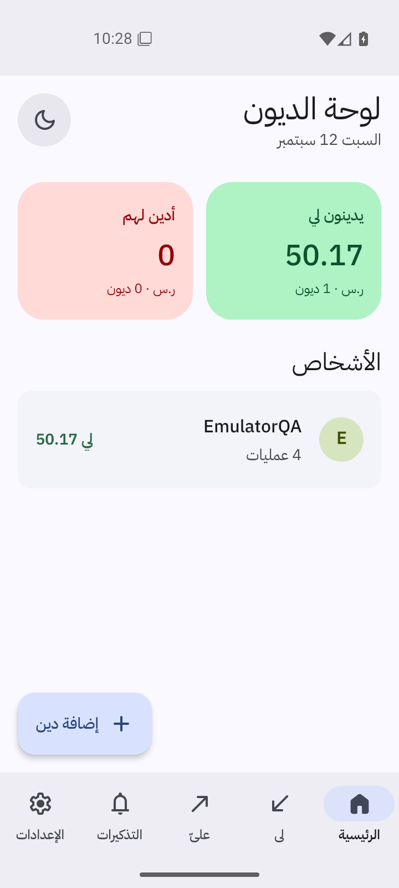
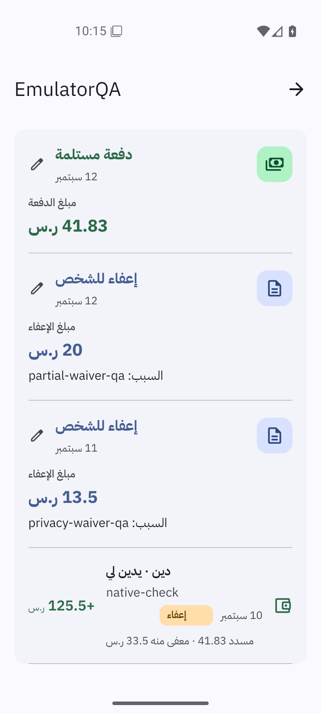
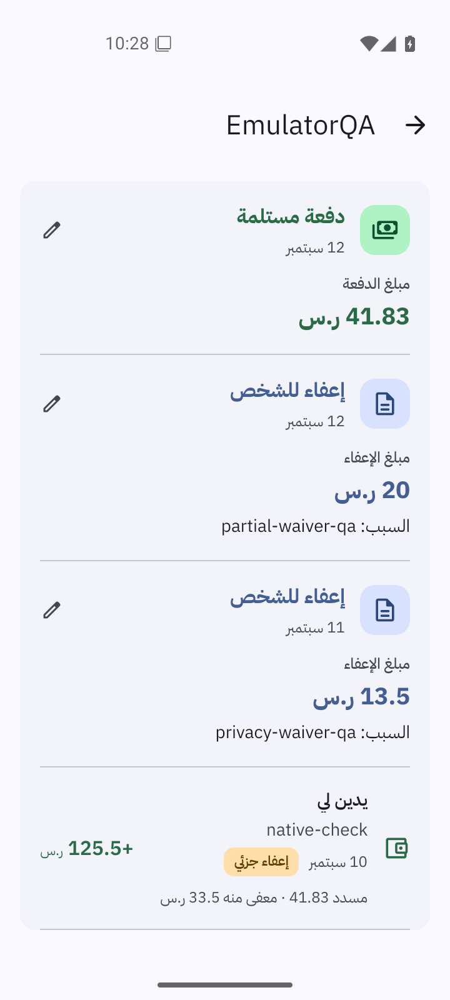

# Android emulator testing

Native QA uses an isolated Android 16 / API 36 Google APIs x86_64 emulator with KVM acceleration. It has no cloud account and contains only synthetic ledger records. The production APK installs under its real package and signature, so native modules, release bundling, upgrades, storage, and the Android keyboard are exercised together.

The workstation launcher and explicit-target ADB wrapper are outside the repository:

```bash
/home/ak/.cache/iou-android-emulator/launch-emulator.sh
/home/ak/.cache/iou-android-emulator/adb-emulator.sh install -r /path/to/iou-VERSION.apk
```

The wrapper targets `emulator-5580` exclusively. Always specify this target; do not use bare ADB when a user's phone might also be attached. The SDK and AVD reside under `/home/ak/.cache/iou-android-emulator/`. PIN credentials for fabricated test data also stay outside the repository. No test records or credentials belong in the runtime app bundle.

For a headless AVD with a virtual hardware keyboard, enable the emulator's OS keyboard:

```bash
/home/ak/.cache/iou-android-emulator/adb-emulator.sh shell settings put secure show_ime_with_hard_keyboard 1
```

Run UI Automator operations sequentially. Ignore offscreen or inverted node bounds. When dismissing the keyboard, use the current `mInputShown` state from `dumpsys input_method`; cached IME flags can remain true after the keyboard closes and cause an extra Back press.

## Native scenarios

- Fill a debt, then add its person inline. Save and verify the amount, note, actual date, direction and installment schedule in a backup.
- Tap amount to show the OS keyboard. Background an unfinished form, unlock, and verify the draft before explicitly cancelling it.
- Enable PIN lock and verify unlock. With no biometric enrolled, verify PIN fallback. Biometric success on physical hardware needs separate verification.
- Choose a local folder through Android's document picker. Verify external picker return locks the app, while an in-app backup confirmation stays unlocked.
- Save two distinct ledgers to that folder. Open history, cancel a restore preview with Android Back, then restore an older copy deliberately. Save the smaller ledger again and verify that rewritten JSON/HTML/CSVs have no trailing bytes and retained snapshots remain usable.
- For installment editing, preview a new monthly day, save, reopen, and undo. Verify short months and completed installments through isolated browser and core tests as well.

A local document provider verifies the Android storage framework and app behavior. It does not establish completion through Dropbox or Drive accounts. Never claim cloud upload completion from merely reaching a provider's upload screen.

## Reproducible browser checks

Start a separate Expo web preview on port 8147 and use fresh browser contexts with synthetic records:

```bash
PLAYWRIGHT_MODULE=/path/to/@playwright/test node scripts/add-debt-ui-checks.cjs
PLAYWRIGHT_MODULE=/path/to/@playwright/test node scripts/installment-day-ui-checks.cjs
PLAYWRIGHT_MODULE=/path/to/@playwright/test node scripts/forgiveness-history-ui-checks.cjs
```

These complement native QA; they do not replace testing Android focus, keyboard and document-provider behavior.

## Measured Alpha 6 result — 2026-09-12

The signed production Alpha 6 APK passed native PIN setup/unlock, background lock, draft preservation after PIN unlock, and actual OS keyboard display. Filling an entry before adding its person preserved the saved amount, actual date, note and three-installment plan, as verified in the exported ledger.

Local SAF backup completed, including the existing-backup confirmation that previously triggered focus locking on the phone. Android Back cancelled a restore preview without leaving the private screen. Restoring the older snapshot returned the ledger from two debts/175.50 to one debt/125.50. Saving again rewrote smaller JSON (965→773 bytes), HTML (14,303→13,183 bytes) and transactions CSV (721→545 bytes) exactly, with no trailing bytes. The previous two-debt copy and all three immutable snapshots remained intact. Canonical JSON, embedded report backup, downloaded CSVs and standalone files agreed.

These are synthetic emulator results. Completed Dropbox account/provider writes and Drive uploads remain unverified.

## Measured Alpha 7 result — 2026-09-12

The independently verified published APK installed over Alpha 6 and retained the PIN and ledger. A synthetic debt had one fully paid installment, one partially forgiven installment and one open installment. The day-31 preview preserved September 17 for the completed row, changed October 17 to October 31, and clamped November 17 to November 30. Save produced exactly one audited correction. Exported backup records verified that only those two dates changed and all cash/forgiveness records remained exact. Native Undo then restored the complete original debt and recorded the reversal; another backup verified the result. See [the native verification record](verification/alpha7-native.json).

## Alpha 8 regression — exemption form after locking

The previous production Alpha 7 APK reproduced a partial exemption changing to a full cash payment on returning from HOME and unlocking with PIN. The selected 13.50 exemption/date/note were replaced by 63.67 full payment/today/empty note. The wrong form was cancelled without saving. [Native reproduction](verification/alpha8-native-before.json).

The independent real-provider/controller/gate harness reproduced lost draft fields, a lost receipt and an enabled duplicate-submission form after remount on old code. The updated production session hook passed all four lifecycle scenarios, including pending work and late callbacks into a replacement session. [Before/after lifecycle evidence](verification/alpha8-lifecycle.json).

The durable full-App browser regression enrolls a real web PIN, selects partial forgiveness in the non-default debt direction, fills amount/date/note, backgrounds, unlocks through the actual PIN screen, verifies every field and submits one exact exemption. It locks/unlocks the receipt and checks that no submit-ready form or duplicate record appears. This is part of the 19-scenario history/creation suite above.

The published Alpha 8 APK passed the same native HOME/PIN cycle with the full draft intact. A single 13.50 exemption saved with its selected date/note, and its receipt remained after another lock/unlock. Native history distinguished both exemptions from the existing cash payment. A subsequent local folder backup advanced its displayed timestamp; all 14 exported files verified exactly against the ledger. Prior transactions/audits and six older snapshots remained unchanged, with one new exemption and snapshot, matching HTML/CSV companions, and no duplicates. Totals were paid 41.83, forgiven 33.50 and remaining 50.17. [Native after-fix evidence](verification/alpha8-native.json).

## Alpha 9 regression — native RTL text alignment

Read-only navigation in the production Alpha 8 emulator showed left-painted text inside correctly ordered RTL rows. Pixel measurements within UIAutomator text bounds gave a 3 px left margin and 167 px right margin for the Home name, and 1 px left / 245 px right for the operation count. Payment headings and debt descriptions behaved similarly; explicitly centered buttons were correctly centered. [Native baseline](verification/alpha9-native-before.json).

The shared text component now uses native automatic alignment with explicit RTL paragraph direction; the browser retains right alignment. Four light/dark, 320/390 px browser cases verified Arabic/mixed names, matching right edges for names/counts and no overflow. Existing 19 history/privacy scenarios also passed. [Browser evidence](verification/alpha9-browser.json).

The published Alpha 9 APK passed all 11 native text comparisons. Home name/count right margins changed from 167/245 px to 0/1 px; payment heading and reason margins changed from 256/283 px to 1/2 px. The debt heading is simply **يدين لي**, and the centered **سداد المتبقي** button retained equal 1 px margins. [Native comparison](verification/alpha9-native.json).

Read-only form inspection confirmed the centered 50.17 amount, left-to-right ISO date and unchanged date through keyboard focus/dismissal, followed by cancellation without saving. A separate existing clipping issue affects a compact debt badge and the forgiveness selector. A fresh published Alpha 8 on temporary emulator-5582 reproduced the selector in both states; its unselected label was pixel-for-pixel identical to Alpha 9. The temporary AVD had separate writable data and was stopped cleanly; the main AVD was not changed by the baseline comparison.

| Home before | Home after |
|---|---|
|  |  |

| History before | History after |
|---|---|
|  |  |

## Alpha 10 — editing a person's name

The user approved the actual pencil entry point and editor before publication. [Person page](screenshots/person-name-person-page.png) and [editor](screenshots/person-name-name-editor.png) show a fictional Arabic record in the web preview.

Nine full-App browser scenarios passed with no browser errors: mixed-direction records and existing corrections stay identical after rename; Home, person/debt details, the person picker and reload use the new name; standalone HTML and all four CSV sheets agree; empty/duplicate/unchanged names, Cancel and Back create no canonical/recovery/history writes; the 100-character bound is enforced; a real PIN lock preserves the draft and allows exactly one save; light/dark layouts fit at 320 and 390 px. [Browser evidence](verification/alpha10-browser.json). The reproducible script is `scripts/person-name-ui-checks.cjs`, with `IOU_TEST_URL` pointing to an isolated web preview and `PLAYWRIGHT_MODULE` pointing to an installed Playwright module.

The published production APK passed native acceptance after updating the existing Alpha 9 emulator ledger. Cancel and hardware Back discard drafts, the system keyboard opens, HOME/PIN unlock preserves the name draft, and one save updates the same person on Home and person/debt details. The pencil is visible in the header and the complete Save label is centered and unclipped. No phone was used.

An independent comparison of the successful manual folder backup found only one person-name change and a new backup timestamp. Person IDs, all four transactions, audit history, settings and installment allocations are exact; paid 41.83, forgiven 33.50 and remaining 50.17 are unchanged. The previous backup is the original canonical file, seven previous snapshots remain intact, one new snapshot matches the canonical file, and all HTML/CSV companions and embedded downloads agree across 15 files. Automatic backup remains off. [Native evidence](verification/alpha10-native.json).

[System keyboard](screenshots/person-name-native-keyboard.png) · [Draft after unlock](screenshots/person-name-native-unlocked.png) · [Renamed person](screenshots/person-name-native-person.png) · [Home after rename](screenshots/person-name-native-home.png).
