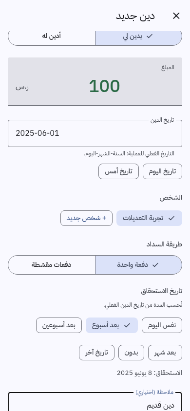
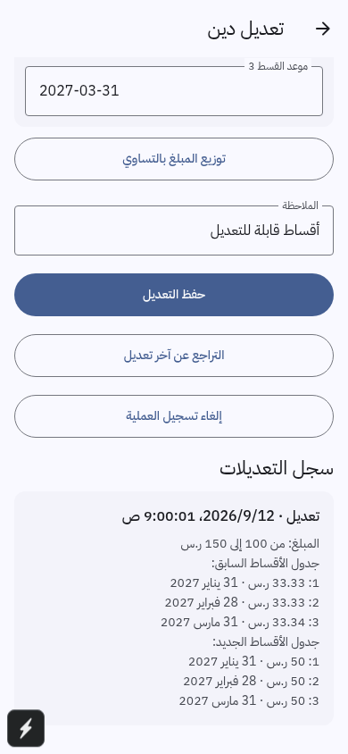
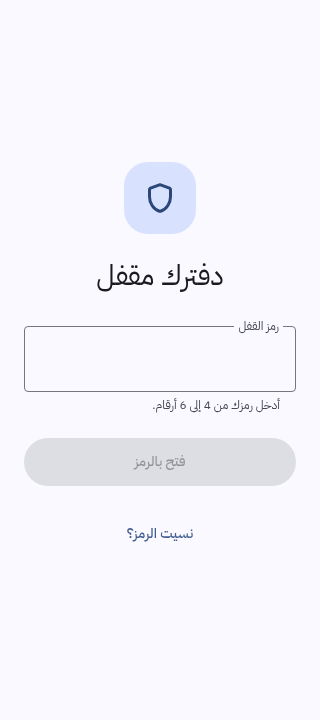
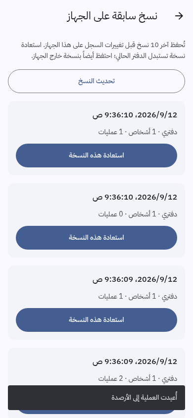
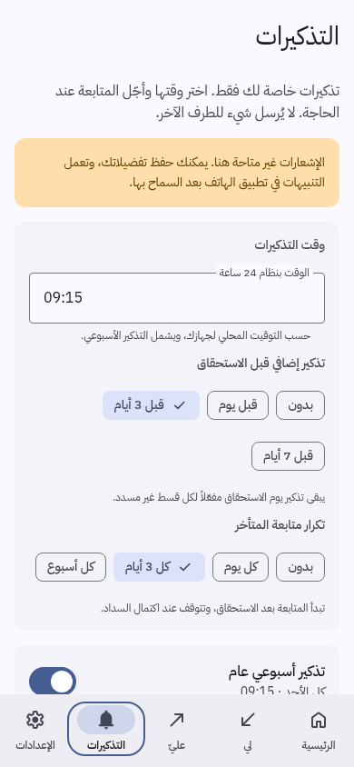
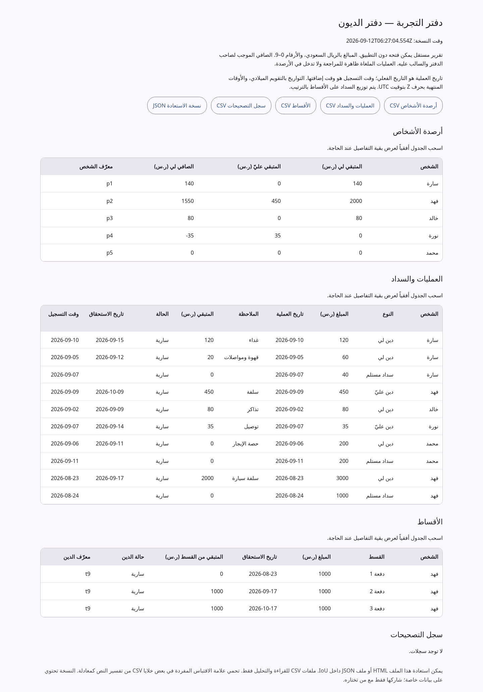

# Corrections, recovery, dates, privacy and reminders

Implemented locally on 2026-09-12. The Arabic Material 3 interface continues to use 0–9 digits, with all people shown directly on Home.

## Using the new features

| Feature | Where to find it | Behavior |
|---|---|---|
| Edit and undo | Open a debt → **تعديل الدين أو إلغاؤه**; tap a payment in the person/debt history | Edit amount, actual date, person, direction, note, due date or existing installment schedule. Undo the latest edit, cancel a mistaken entry, or restore a cancellation. |
| Debt forgiveness | Recording an entry → **إعفاء من الدين**, or open the debt's forgiveness action | Waive all or part of a debt with an actual date and optional reason. Cash paid and forgiven amounts remain separate in history, installments, and readable exports. |
| Recovery and spreadsheets | Settings → **النسخ السابقة والتصدير للجداول** | Open local/folder history; export a readable report or individual CSV tables; optionally protect an export with a separate password. |
| Actual transaction dates | Debt/payment forms → **تاريخ الدين / تاريخ الدفعة** | Choose the date money changed hands; today/yesterday shortcuts are available. The original recording timestamp is retained separately. |
| Optional privacy lock | Settings → **قفل التطبيق** | Confirm a 4–6 digit PIN; enable supported strong biometrics with PIN fallback. Lock on leaving the app, or use **قفل الآن**. |
| Flexible reminders | **التذكيرات** tab | Set a local time, advance notice, overdue cadence, weekly day, notification privacy and individual snoozes. |

## Financial corrections

Corrections preserve exact before/after snapshots. Cancellation adds a `voidedAt` timestamp; cancelled records remain visible in person/payment history and exported tables, and contribute nothing to balances or reminders. Restoring an entry validates its relationships and outstanding balance again. Undo of the latest edit is itself recorded as a correction; it does not erase history.

A debt cannot be reduced below its combined active payments and forgiveness, cancelled while either exists, or reassigned while it has active reductions. Cancel its linked entries first when correcting the person/direction. A payment or forgiveness cannot exceed the remaining amount. Editing and restoring reductions recheck the target person, active debt, amount, and dates. Reminder opt-outs survive debt cancellation/restoration.

Forgiveness uses its own transaction type with edit/undo/cancel/restore history. It never counts as cash received or paid. Full forgiveness closes as **معفى بالكامل**; mixed cash and forgiveness closes as **مغلق بسداد وإعفاء**. Ledger formats 1 and 2 migrate to format 3, preserving payments, correction history and reminder choices.

Existing installment rows can be edited; their positive amounts must sum exactly to the debt in integer halalas, with strictly increasing dates. **توزيع المبلغ بالتساوي** explicitly redistributes an edited amount. Both old and new schedules appear in the correction history.

New transaction dates cannot be in the future. A payment cannot predate its debt; a debt cannot move after one of its payments. New or changed due dates cannot predate the actual debt date. Due-date presets count from the actual debt date, and month presets retain calendar-month behavior. Existing version 1 data migrates without inventing recording timestamps or rejecting unchanged legacy date quirks.

Person-wide payments apply only to debts that existed on the selected payment date, oldest first within the chosen direction. The confirmation still reports the person's full current remaining balance, including later debts.

## Recovery and privacy boundaries

The device keeps ten dated snapshots before ledger changes and a previous copy. Startup tries each recovery source independently and displays a notice when recovering. Unreadable history is preserved before repair; failed writes remain visible and block further normal editing. Restoring a local snapshot preserves this device's backup destination and privacy lock and requires a manual first external save before automatic backup resumes.

Folder backups keep ten verified immutable JSON snapshots, compatibility mirrors, a standalone HTML report, and four CSV companions. The manual HTML report opens offline without IoU and contains downloadable spreadsheet tables and the full recoverable JSON. Imports validate the data without executing imported HTML. See [backup formats and encryption](BACKUPS.md).

The optional app lock is an access gate. Native PIN verification data stays in SecureStore and is excluded from backups. Browser lock limitations are stated in the UI. Enabling the lock hides notification details by default; the user may change that preference. Restores into a locked device also default to private notification previews. The optional protected export uses a separate password and works outside the app; ordinary folder/CSV/report exports remain readable. See [privacy implementation and device checks](../src/privacy/README.md).

Reminders stop for closed (paid or forgiven), cancelled, or disabled debts, offer advance notices and overdue follow-ups, and keep at most 60 upcoming debt notifications plus the weekly reminder. The schedule refreshes on app foregrounding. Browser preview saves preferences and explains that native delivery is unavailable there. See [scheduling details](FLEXIBLE_REMINDERS.md).

## Original feature verification

- TypeScript and `git diff --check` passed.
- `npm run check`: **1,014 assertions** — 101 core, 129 entry/date/recovery, 47 backup, 12 encryption, 74 privacy, 130 reminder planning, 25 notification adapter and 496 Material contrast checks.
- **57 isolated browser/report workflows** passed with fabricated data and no runtime page errors: 15 entry/date/local recovery, 9 installment/reminder integration, 13 privacy, 12 app backup and 8 standalone report workflows. The existing collaborative preview's data was not modified by tests.
- Integrated screens were checked at 320, 390 and 1440 px; privacy and backup screens also at narrow dark layouts. Switch and selection state is explicitly exposed to web accessibility tools; visible generated numbers remain 0–9.
- Android production Hermes export passed using Expo SDK 57 and Node 22. Exporting verifies the bundle, not APK installation, biometric hardware or notification delivery.

Browser scripts/results were recorded under `/tmp/iou-features`, `/tmp/iou-privacy`, and `/tmp/iou-recovery`; final Android export is `/tmp/iou-features/android-final`. Persistent test scripts live in `scripts/`, and representative screenshots are linked below.

| Transaction date | Correction history | Optional lock |
|---|---|---|
|  |  |  |

| Local recovery | Reminders | Readable backup |
|---|---|---|
|  |  |  |

Before a stable release, test native biometric success/cancellation, background/app-switcher behavior, notification permission/delivery, folder grants/provider failure, sharing and recovery on a real device. Direct Google Drive authorization remains disabled until its separate native integration is completed and verified. Folder synchronization depends on the selected provider.

Alpha 2 adds native PIN derivation and bounded errors, manual Google Drive sharing/restoration, and distinct forgiveness. See [Alpha 2 release notes](releases/0.1.0-alpha.2.md) for changes and device-validation limits.
