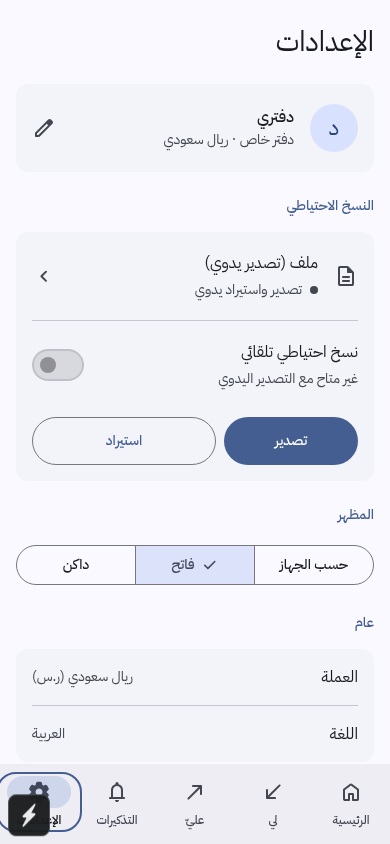
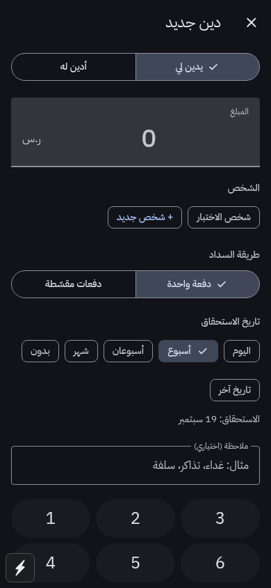
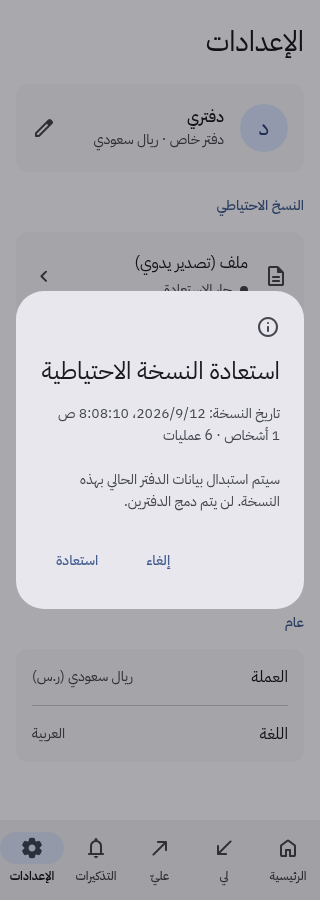
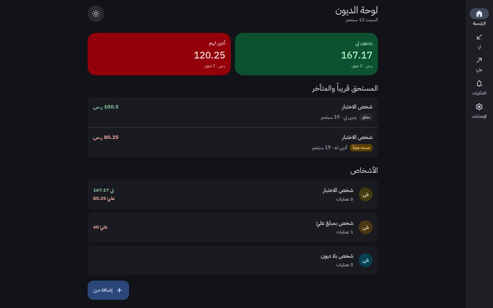

# Material 3 UI update — 2026-09-12

The ledger now uses Material 3 color roles, typography, shapes, navigation and
interaction states, adapted for Arabic and right-to-left reading. The blue brand
seed and distinct receivable/payable colors remain part of the design.

## Design decisions

- **Color:** Google's Material Color Utilities generates separate light/dark
  tonal palettes from the saved accent. Text uses the corresponding foreground
  role. Surface levels establish grouping; outline colors distinguish field
  boundaries from dividers. Four supported accents are checked in both themes.
  See [Material color roles](https://m3.material.io/styles/color/roles) and
  [Material Web's color guidance](https://material-web.dev/theming/color/).
- **Numerals:** All generated amounts, counts, dates and reminder times use
  `0–9` digits, with comma grouping and a decimal point. Arabic text and RTL
  layout remain. Amount entry also accepts Arabic-Indic/Persian keyboard digits.
- **Type and icons:** IBM Plex Sans Arabic follows the Material type scale,
  with additional Arabic body leading and no added letter spacing. Local subsets
  of Material Symbols Rounded replace text-like decorative icons. Selected
  destinations use filled icons. [Font provenance and license](../assets/fonts/README.md).
- **RTL text:** The shared text component declares an RTL paragraph and uses
  automatic native alignment. Explicit native `right` alignment is mirrored
  inside an RTL paragraph; using its leading edge keeps Arabic and mixed-script
  names, counts and descriptions on the right. Web text retains `right`, and
  caller overrides keep centered controls centered. See the [native regression](ANDROID-TESTING.md#alpha-9-regression--native-rtl-text-alignment).
- **Navigation:** Compact windows use an 80dp-minimum navigation bar. At 600dp,
  it becomes an 80dp rail on the right; content has a bounded, centered width.
  Destination labels can wrap and increase the bar height. See
  [adaptive layout](https://m3.material.io/foundations/layout/applying-layout/overview),
  [navigation bar accessibility](https://m3.material.io/components/navigation-bar/accessibility)
  and [bidirectionality](https://m3.material.io/foundations/layout/bidirectionality-rtl).
- **Controls:** Filled and outlined buttons, connected segmented buttons,
  chips, switches and the extended add button use consistent sizing. Primary
  interactive targets are at least 48dp. Focus, selection, hover and pressed
  states are visible. See [interaction states](https://m3.material.io/foundations/interaction/states/applying-states).
- **Forms:** Persistent labels, outlined fields, supporting text and associated
  error messages clarify person, date and note entry. The amount remains directly
  editable with the system decimal keyboard. See [text fields](https://m3.material.io/components/text-fields/guidelines).
- **Dialogs:** Restore/overwrite confirmations use a themed dialog with a clear
  title, explanation and explicit actions. Keyboard focus stays inside; Escape,
  cancel and backdrop dismissal preserve the current ledger. See
  [dialog accessibility](https://m3.material.io/components/dialogs/accessibility).
- **Information hierarchy:** Upcoming debts appear as a vertical list, initially
  showing three records with an expand action. The people section shows everyone
  directly, with no direction filters. Large balances and narrow-screen
  actions adapt to available space. Settings separates profile, backup, appearance
  and general information. Profile renaming has explicit save/cancel actions.

The existing debt, settlement and backup safeguards remain the underlying
behavior. This update implements Material patterns using React Native components;
it does not introduce a new routing or account system.

## Verification

- `npm run typecheck`: passed.
- `npm run check`: 101 core + 27 backup + 496 Material text-contrast assertions
  passed. The contrast checks cover four accents in light/dark themes and the
  actual hover/pressed overlays used by controls. Lowest tested ratio: 4.506:1.
- The existing 19 browser workflow checks passed with themed confirmations,
  including payment direction, partial installments, export, cancelled/invalid/
  confirmed restore, persistence failure and local recovery.
- 72 screen/theme/size captures checked: eight ledger/form screens at 320/390px
  in light/dark, plus home/settings/backup/dialog at 320/390/600/840/1440px in
  light/dark. No page-level horizontal overflow or browser runtime errors.
- Focused checks covered navigation target sizes and right-side rail placement,
  rename validation, dialog focus containment/Escape/focus return, error-message
  association, backdrop cancellation, 200% browser text, nine-digit amounts,
  three-column keypad layout and upcoming-list expansion.
- Android production export passed using Expo SDK 57 and Node 22:
  `npx expo export --platform android --output-dir /tmp/iou-m3/android-verified`.
- `git diff --check`: passed.

After the requested switch to `0–9` digits, TypeScript, all 624 assertions and
the 19 browser workflows passed again. Current screenshots were refreshed;
amount/date input normalization, reminder times and restore numbers were checked.

Browser captures use fabricated records in isolated storage.
Native font scaling, TalkBack, folder grants and keyboard behavior still require
an Android device check; web layout and production bundling do not establish
native accessibility behavior.

## Current screens

| Home | Settings |
|---|---|
|  |  |

| Add debt, dark | Restore confirmation |
|---|---|
|  |  |

