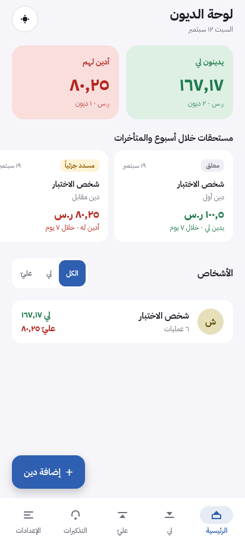
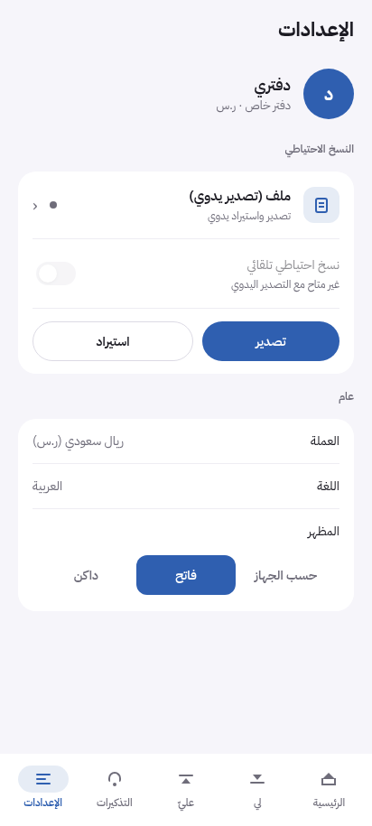
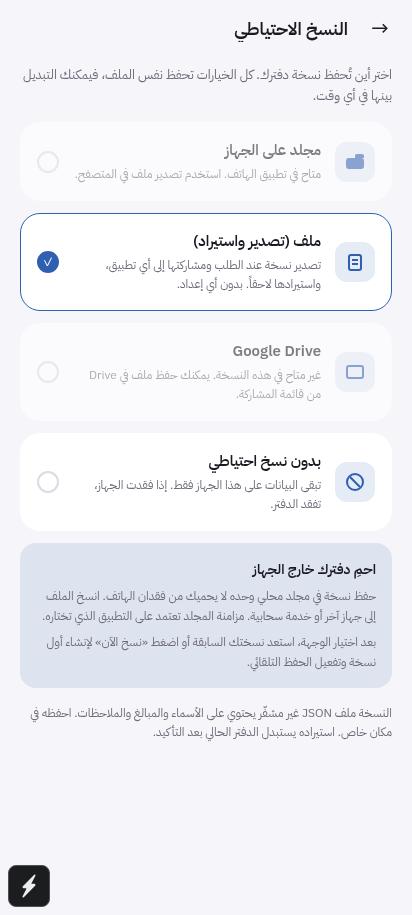
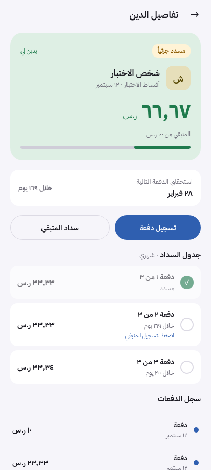

# UI, backup, and ledger review — 2026-09-12

The private, Arabic-first offline ledger is a useful core product. The most
important improvements were protecting the records and making the direction of
money unmistakable. The initial pass retained the prototype style while making these fixes. A subsequent
[Material 3 update](MATERIAL3.md) replaces that styling and includes current screenshots.

The later [feature update](FEATURES.md) adds editing/undo, actual transaction
dates, ten-version recovery, readable/protected exports, optional privacy lock,
and flexible reminders. The verification below records the original review.

## Findings and changes

| Area | Finding | Improvement |
|---|---|---|
| Balances | Home netted opposing debts, hiding real outstanding amounts. | Home and person views show receivables and payables separately; net is explicitly informational. |
| Payments | Net-zero people could not settle, mixed-direction payments were ambiguous, and overpayments could be silently truncated. | Select received/paid direction; allocate within that direction oldest-first; reject overpayment and mismatched owners; confirm the amount actually recorded. |
| Installments | Repeated 30-day offsets drifted across months; partially paid installments requested the original amount. | Calendar months with end-of-month clamping, exact halala arithmetic, correct final remainder, and payment of only the unpaid portion. |
| First use | New installations contained fictional debts. | Start empty with clear guidance. Sample data stays behind an explicit development flag. |
| Forms and navigation | Keypad-only amounts and preset-only dates limited entry; payment back navigation could open the wrong screen. | Editable Arabic/Persian amounts, two-decimal validation, custom dates, honest first-payment previews, correct return navigation and clearer button states. |
| Accessibility and appearance | Controls lacked labels/roles or usable touch targets; system theme could not be restored. | Labelled controls, disabled/selected states, larger targets, standard keypad order, and system/light/dark choices. |
| Local storage | A failed read could replace the ledger with defaults, writes were unordered, and errors were swallowed. | Validated reads, serialized writes, previous-state recovery, persistent recovery notice, visible write failures, retry of live unsaved changes, and file recovery without setup. |
| Restore | Any object with people/transaction arrays was accepted; busy state ended before confirmation. | Validate the record graph/version/dates/amounts; preview date/counts; hold the operation through confirmation and durable save; reject concurrent edits. |
| Backup safety | Startup/selection could overwrite a backup before restore; folder writes destroyed the only copy. | No upload on startup/selection; explicit first save; overwrite confirmation; verified previous folder copy; interrupted-write recovery; suspension after local recovery. |
| Backup portability | Exports included device folder permissions and status; browser export/import was missing. | Portable whitelist, legacy v1 compatibility, web download/import, and preservation of this device's destination. Manual sharing makes no claim that a copy was saved. |
| Backup communication | Local folders appeared to guarantee cloud protection; Drive required more than client IDs. | Explain same-device limitations and plaintext contents, show platform availability, keep direct Google Drive disabled pending supported authorization. |
| Reminders | Permission could be prompted automatically, installment dates/amounts were stale, and availability was hidden. | Explicit permission action, correct local-calendar dates and unpaid amounts, serialized scheduling, visible availability, refresh on foreground/day changes. |
| Build | CI used Node 20 despite Expo SDK 57 requiring a newer runtime. | CI now uses Node 22; Android export verified with Node 22.23.2. |

## Verification

- `npm run typecheck`: passed.
- `npm run check`: **101 core checks + 27 backup checks passed**. Covers
  validation, payment direction/ownership/overpayment, cent precision,
  month-end/leap-year/timezone behavior, reminder planning, ordered storage,
  interrupted folder writes and recovery.
- **19 browser checks passed** in a fresh isolated Chromium context: onboarding,
  empty install, Arabic decimal entry, both debt directions, net-zero payments,
  reload persistence, monthly installments, partial installment remainder,
  notification availability, system theme, portable downloads, cancelled restore,
  invalid restore, successful restore, failed write/retry, corrupt local recovery,
  preservation of unread data, file recovery without setup, and 320px layout.
  No runtime page errors were observed.
- Additional walkthroughs covered 390px/light and 320px/dark, invalid dates and
  amounts, month presets, disabled future installment actions and input bounds.
- Android production JavaScript/Hermes export passed using Expo SDK 57 and Node
  22.23.2: `npx expo export --platform android --output-dir /tmp/iou-review/android-final`.
  This verifies bundling, not APK installation or native device behavior.
- `git diff --check`: passed.

Screenshots use test records, not a real person's ledger.

| Home | Settings |
|---|---|
|  |  |

| Backup options | Installments |
|---|---|
|  |  |

## Remaining release work

1. Exercise Android folder grants after reboot, unavailable providers, full
   storage, interrupted writes, share cancellation, restore, keyboard behavior,
   and notification permission/delivery on a real device. Verify iOS
   session-scoped folder access if distributing iOS. No emulator/device was
   available in this session.
2. Implement and verify supported native Google authorization before enabling
   `expo.extra.google.enabled`. Client IDs alone do not fix the generic
   `iou://oauthredirect` flow. [Google's native OAuth documentation](https://developers.google.com/identity/protocols/oauth2/native-app)
   describes Android restrictions and callback requirements; [Expo's guide](https://docs.expo.dev/guides/google-authentication/)
   describes native integrations. Manual file sharing to an installed Drive app
   remains an available option.
3. Verify the new optional biometric/PIN lock during app switching and native
   authentication. Corrections/reversals and visible history are now implemented;
   direct multi-device synchronization remains outside this release.

Ordinary backups remain readable; optional password-protected reports are now
available. Folder and device history each retain 10 dated recovery points. Automatic
backups follow edits while the app is open; they are not a background service.
After local recovery, automatic backup stays suspended for that session so an
older local snapshot cannot silently replace a newer external copy. Manual
backup remains possible after overwrite confirmation, and restore remains
available. Notifications schedule the nearest 60 future payment reminders plus
the weekly reminder; opening the app rebuilds the upcoming schedule.
